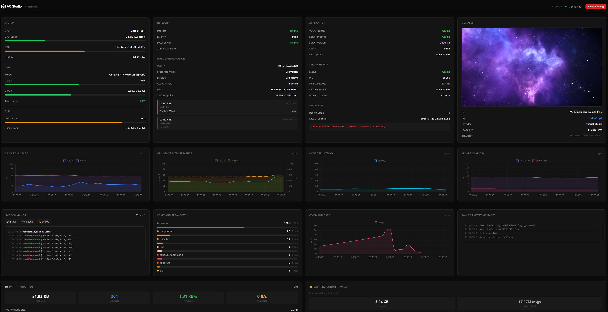

# vu-watchdog

System health monitor and watchdog for [Vu One OS](https://vu.studio) display wall installations. Collects hardware telemetry, network health, and application state, then publishes everything over MQTT for remote monitoring. Includes a local real-time dashboard and runs minimized to the Windows system tray.

Compiles to a single portable `.exe` via [Bun](https://bun.sh).



## Features

- **Real-time telemetry** — CPU, RAM, GPU (NVIDIA), disk, network latency, process health
- **MQTT publishing** — All metrics published to a remote broker for cloud dashboards
- **Remote screen viewing** — WebRTC streaming with MQTT signaling (no port forwarding needed)
- **Stream quality control** — Presets (low/medium/high) or custom resolution/fps/bitrate
- **Command plane** — Remote control via MQTT with acknowledgements and lease system
- **Local dashboard** — Browser-based UI at `http://localhost:3200` with live charts
- **System tray** — Runs minimized; tray icon for dashboard access, console toggle, and quit
- **OSC listener** — Receives Open Sound Control commands from Vu One and forwards them
- **Last Will & Testament** — Automatic online/offline detection via MQTT LWT
- **Single exe** — Everything bundled into one Windows executable

## Requirements

- Windows 10/11
- [Bun](https://bun.sh) (for development; not needed to run the compiled exe)
- Vu One OS installed at `C:\Program Files (x86)\Vu One OS`
- Network access to the MQTT broker

## Getting Started

```bash
# Install dependencies
bun install

# Development (auto-reload)
bun run dev

# Production
bun run start

# Build standalone exe
bun run build
```

## Configuration

The watchdog reads configuration from the Vu One OS installation:

| File | Location | Contents |
|------|----------|----------|
| `app.config.json` | `Vu One_Data/StreamingAssets/Vu One/` | `wallId`, `websocketPort`, `httpPort` |
| `system.config.json` | `Vu One_Data/StreamingAssets/Vu One/` | Display layout, network, UI settings |

### Environment Variables

| Variable | Default | Description |
|----------|---------|-------------|
| `MQTT_BROKER_URL` | `mqtt://tramway.proxy.rlwy.net:20979` | MQTT broker TCP URL |
| `MQTT_BROKER_WS_URL` | `wss://mqtt.vu.studio/mqtt` | MQTT broker WebSocket URL (for dashboard) |
| `MQTT_USERNAME` | `dev` | Broker username |
| `MQTT_PASSWORD` | `testing` | Broker password |

## Architecture

```
+------------------+       +---------------+       +-------------------+
|   Vu One OS      |       |  vu-watchdog  |       |   MQTT Broker     |
|   (Unity app)    |       |               |       |                   |
|                  |       |  collectors   |       |                   |
|  OSC output ----UDP----> |  osc listener | ----> | vu/{id}/commands  |
|  config files --file---> |  config reader| ----> | vu/{id}/config    |
|  error.log -----file---> |  log parser   | ----> | vu/{id}/telemetry |
|  vu-server.lock -file--> |  lock reader  |       | vu/{id}/health    |
|  /connected-users HTTP-> |  network check|       |                   |
+------------------+       +-------+-------+       +-------------------+
                                   |
                           +-------+-------+
                           |  Dashboard    |
                           |  :3200        |
                           |  WebSocket+UI |
                           +-------+-------+
                                   |
                           +-------+-------+
                           |  System Tray  |
                           |  (NotifyIcon) |
                           +---------------+
```

## MQTT Namespace

All topics use the namespace `watchdog/{wallId}/` where `wallId` comes from the Vu One OS configuration.

### Namespace Tree

```
watchdog/{wallId}/
├── telemetry              # System metrics (QoS 0, no retain, 2s interval)
├── status                 # Online/offline + stream status (QoS 1, retain, LWT)
├── config                 # App + system config (QoS 0, retain, 60s)
├── health                 # Bounded health summary (QoS 1, retain)
├── event                  # Lifecycle events (QoS 1, no retain)
├── control                # Legacy inbound commands (QoS 1, no retain)
├── commands               # OSC commands from Vu One OS (QoS 0, no retain)
├── lease                  # Control lease (QoS 1, retain)
├── command/{clientId}     # Command plane inbound (QoS 1, no retain)
├── ack/{clientId}         # Command acknowledgements (QoS 1, no retain)
├── stream/
│   └── status             # Streaming state (QoS 1, retain)
└── webrtc/
    ├── offer              # Publisher SDP offers (QoS 1, retain)
    ├── answer             # Viewer SDP answers (QoS 1, no retain)
    ├── ice                # ICE candidates (QoS 1, no retain)
    ├── join               # Viewer join requests (QoS 1, no retain)
    └── leave              # Viewer disconnect (QoS 1, no retain)
```

### Topic Details

#### Telemetry & Status

| Topic | QoS | Retain | Interval | Schema | Description |
|-------|-----|--------|----------|--------|-------------|
| `telemetry` | 0 | No | 2s | — | Full system/network/app metrics |
| `status` | 1 | Yes | On change | — | Online/offline status with stream info (LWT) |
| `config` | 0 | Yes | 60s | — | App + system configuration |
| `health` | 1 | Yes | On change | `vu.watchdog.health.v1` | Bounded health summary |
| `event` | 1 | No | On event | `vu.watchdog.event.v1` | Lifecycle events |

#### Command Plane

| Topic | QoS | Retain | Direction | Schema | Description |
|-------|-----|--------|-----------|--------|-------------|
| `command/{clientId}` | 1 | No | Inbound | `vu.watchdog.command.v1` | Commands from remote clients |
| `ack/{clientId}` | 1 | No | Outbound | `vu.watchdog.ack.v1` | Command acknowledgements |
| `control` | 1 | No | Inbound | — | Legacy command shim |
| `lease` | 1 | Yes | Bidirectional | `vu.watchdog.lease.v1` | Control lease for exclusive access |

#### Streaming & WebRTC

| Topic | QoS | Retain | Direction | Description |
|-------|-----|--------|-----------|-------------|
| `stream/status` | 1 | Yes | Outbound | Current streaming state + quality |
| `webrtc/offer` | 1 | Yes | Outbound | Publisher SDP offers |
| `webrtc/answer` | 1 | No | Inbound | Viewer SDP answers |
| `webrtc/ice` | 1 | No | Bidirectional | ICE candidates |
| `webrtc/join` | 1 | No | Inbound | Viewer join requests |
| `webrtc/leave` | 1 | No | Inbound | Viewer disconnect |

### Payload Schemas

#### Status (with LWT)
```json
{
  "status": "online",
  "wallId": "5538",
  "timestamp": 1234567890,
  "stream": { "status": "stopped" }
}
```

#### Health (`vu.watchdog.health.v1`)
```json
{
  "schema": "vu.watchdog.health.v1",
  "ts": 1234567890,
  "wallId": "5538",
  "mode": "READY",
  "conditions": [],
  "system": { "cpu": 25, "mem": 60, "gpu": 15, "disk": 84 },
  "network": { "internet": true, "latencyMs": 42, "localServer": true, "peers": 0 },
  "app": { "vuos": "RUNNING", "server": "RUNNING", "lockHealthy": true, "recentErrors": 0 }
}
```

#### Command (`vu.watchdog.command.v1`)
```json
{
  "schema": "vu.watchdog.command.v1",
  "ts": 1234567890,
  "commandId": "cmd-abc123",
  "ttlMs": 15000,
  "type": "START_STREAM",
  "args": { "monitor": 0, "quality": "medium" }
}
```

**Command Types:**
| Type | Args | Description |
|------|------|-------------|
| `START_VUOS` | — | Launch Vu One OS |
| `STOP_VUOS` | — | Kill Vu One OS |
| `RESTART_VUOS` | — | Restart Vu One OS |
| `QUIT_WATCHDOG` | — | Shutdown watchdog |
| `SWITCH_BROKER` | `brokerId` | Switch MQTT broker |
| `REQUEST_TELEMETRY` | — | Force telemetry publish |
| `REQUEST_CONFIG` | — | Force config publish |
| `START_STREAM` | `monitor`, `quality` | Start screen streaming |
| `STOP_STREAM` | — | Stop streaming |
| `SET_STREAM_QUALITY` | `quality`, `width`, `height`, `fps`, `bitrate` | Change stream quality |

#### Ack (`vu.watchdog.ack.v1`)
```json
{
  "schema": "vu.watchdog.ack.v1",
  "ts": 1234567890,
  "commandId": "cmd-abc123",
  "status": "APPLIED",
  "message": "Streaming started",
  "details": {}
}
```

**Ack Statuses:** `RECEIVED`, `ACCEPTED`, `APPLIED`, `REJECTED`, `FAILED`, `EXPIRED`

#### Stream Status
```json
{
  "status": "running",
  "pid": 12345,
  "port": 8000,
  "startedAt": 1234567890,
  "viewerUrl": "http://localhost:8000/webrtcstreamer.html?video=desktop",
  "error": null,
  "monitor": 0,
  "quality": { "width": 1920, "height": 1080, "fps": 30, "bitrate": 3000 },
  "available": true
}
```

**Quality Presets:**
| Preset | Width | Height | FPS | Bitrate |
|--------|-------|--------|-----|---------|
| `low` | 1280 | 720 | 15 | 1000 kbps |
| `medium` | 1920 | 1080 | 30 | 3000 kbps |
| `high` | 1920 | 1080 | 60 | 6000 kbps |

#### Lease (`vu.watchdog.lease.v1`)
```json
{
  "schema": "vu.watchdog.lease.v1",
  "ts": 1234567890,
  "owner": "dashboard-abc123",
  "expiresTs": 1234567900
}
```

### Last Will and Testament (LWT)

When the watchdog connects, it registers an LWT message on `watchdog/{wallId}/status`. If the watchdog crashes or loses connection, the broker automatically publishes:

```json
{
  "status": "offline",
  "wallId": "5538",
  "timestamp": 1234567890,
  "stream": { "status": "stopped" }
}
```

This allows remote clients to immediately detect when a wall goes offline.

## Remote Screen Viewing

The watchdog includes WebRTC-based remote screen viewing with MQTT signaling. No port forwarding required — all signaling goes through the MQTT broker.

### Starting a Stream

**Via MQTT command:**
```json
{
  "schema": "vu.watchdog.command.v1",
  "ts": 1234567890,
  "commandId": "cmd-123",
  "ttlMs": 15000,
  "type": "START_STREAM",
  "args": { "monitor": 0, "quality": "medium" }
}
```

**Via HTTP API:**
```bash
curl -X POST http://localhost:3200/api/stream-start \
  -H "Content-Type: application/json" \
  -d '{"monitor": 0, "quality": "medium"}'
```

### Viewer Setup

Viewers connect to the same MQTT broker and use WebRTC signaling via the `webrtc/*` topics. See [docs/remote-viewing.md](docs/remote-viewing.md) for detailed setup instructions and sample viewer code.

### Changing Quality While Streaming

```json
{
  "type": "SET_STREAM_QUALITY",
  "args": { "quality": "low" }
}
```

## Dashboard

The built-in dashboard at `http://localhost:3200` provides:

- Live CPU, RAM, GPU, and disk usage charts
- Network connectivity and latency monitoring
- Application process status
- OSC command log
- Configuration viewer
- **Kill Watchdog** button for remote shutdown

When accessed locally (port 3200), it connects via WebSocket. When hosted elsewhere, it falls back to MQTT over WebSocket.

## System Tray

On Windows, the watchdog starts minimized to the notification area:

- **Left-click** — Opens the dashboard in your default browser
- **Right-click menu:**
  - Open Dashboard
  - Show Console
  - Quit

## Project Structure

```
vu-watchdog/
├── src/
│   ├── index.ts          # Entry point, startup orchestration
│   ├── server.ts         # HTTP + WebSocket server (port 3200)
│   ├── mqtt.ts           # MQTT broker connection and publishing
│   ├── config.ts         # Reads Vu One OS config files
│   ├── types.ts          # TypeScript interfaces
│   ├── console.ts        # Win32 console show/hide
│   ├── tray.ts           # System tray via PowerShell NotifyIcon
│   └── collectors/
│       ├── system.ts     # CPU, RAM, GPU, disk, uptime
│       ├── network.ts    # Internet check, latency, local server
│       ├── app.ts        # Process detection, server lock, error log
│       └── osc.ts        # UDP OSC listener and parser
├── index.html            # Dashboard UI (embedded at build time)
├── logo.svg              # Source icon
├── logo.ico              # Windows icon (16/32/48/256px)
├── scripts/
│   ├── build-ico.ts      # SVG to ICO converter
│   └── set-icon.ts       # Patches exe icon via rcedit
├── package.json
└── tsconfig.json
```

## Build

```bash
bun run build
```

This runs two steps:
1. `bun build --compile` — Bundles all TypeScript + HTML into a single `vu-watchdog.exe`
2. `scripts/set-icon.ts` — Patches the Vu logo icon onto the exe via rcedit

### Regenerating the Icon

```bash
bun scripts/build-ico.ts   # logo.svg -> logo.ico
bun run build               # Rebuild exe with new icon
```

## Dependencies

| Package | Purpose |
|---------|---------|
| `mqtt` | MQTT 5.0 client |

Dev dependencies: `@resvg/resvg-js` (SVG rendering), `rcedit` (exe icon patching), `@types/bun`.

## License

Proprietary. All rights reserved.

## Author

**Alvin Renz Teves**

Vu Labs — Research & Development
[vu.studio](https://vu.studio)
